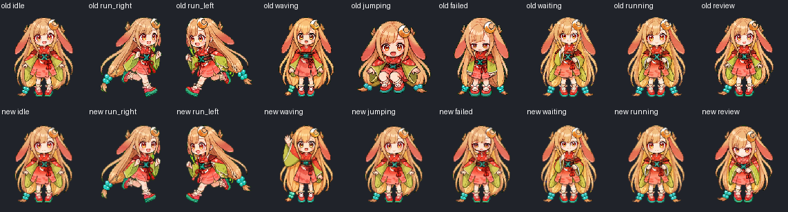

# Pet Kaguya

Local Kaguya sprite assets, reproducible animation tools, and an honest quality audit.

## Current work: identity repair before motion

Phase 5 now has an **idle-only motion candidate** in `candidates/phase5/idle/`, rebuilt exclusively from the selected v3 mother pose. It preserves face geometry as a rigid translation, fixes entire shoes, and uses actual six-pose/6600 ms native holds. The viewer compares fixed pose vs motion at real sizes. This is not a full atlas or installable pet; other states and 16 directions are still incomplete. [Current progress and limits (中文)](docs/PHASE5.zh-CN.md).

The user has now selected **the earlier gently tapered AI-generated mother pose, v3**. The authoritative immutable source is `sources/canonical/artwork.png` with its decision/hash in `sources/canonical/manifest.json`. Its face shape is locked; no fallback to rejected face composites or procedural facial-geometry repairs. The development viewer defaults to this selected pose. Only idle is built, visual motion acceptance is pending, and the installed atlas remains untouched.

`candidates/phase4/static/` preserves a **rejected static prototype**, not an installable animation or approved foundation. The user agreed on the intended original front-idle proportions, restrained closed smile, mild failed expression, and chin-touching waiting gesture, but subsequently reported that many rendered images looked very bad. Direction agreement is not result approval.

The prototype mechanically shares a head/ears/ornament plate and restores foreground hands. This passes bounded pixel checks, **not** whole-character, head/neck, costume, seam, or aesthetic acceptance. It is not to be animated or promoted. A coherent complete-character source/layer model is still needed; copying a common head onto independent bodies is insufficient.

`baseline/phase3/` preserves the previous candidate, including its confirmed failed/waiting defects. **`pet/` is still that old Phase 3 candidate; do not mistake it for the Phase 4 repair.** The installed pet has not been replaced during this stage.

- [Full scope and outstanding acceptance gates (中文)](docs/REQUIREMENTS.zh-CN.md)
- [Static structure review and rejected experiments (中文)](docs/STATIC-REVIEW.zh-CN.md)

`candidates/phase4/canonical-v2/`, `canonical-v3/`, and `canonical-v4/` preserve generated mother-pose iterations and prompts, not animation atlases. These edits changed non-jaw pixels: they are not exact local edits or lossless upscales. The user subsequently chose v3 as the complete mother pose. `canonical-local-jaw/` is a rejected procedural experiment: its local fields kinked hair. It must not be used in production. `tools/review_jaw.py` preserves strict-edit diagnostics using a shared transform, not independent face fitting.

## Previous gentle-motion candidate (not visually accepted)

`pet/` contains the compatible old candidate. All nine animated states and sixteen look directions were rebuilt from per-row poses, but this did NOT establish cross-state identity or correct face compositing. No host patch or claimed native FPS/resolution upgrade.

The complete usable baseline is tagged **`baseline-phase2-complete-20261008`**. The earlier tag `baseline-phase2-20261008` contains only metadata due to an initial copy-path error; it is not an installable baseline.

- [First principles and five-step plan (中文)](docs/PLAN.zh-CN.md)
- [Real problems, fixes, remaining limitations (中文)](docs/ISSUES.zh-CN.md)
- [Validation and uncertainty (中文)](docs/VALIDATION.zh-CN.md)
- [Reproducible before/after metrics](qa/comparison.json)



### Build / test / preview

Requires Python 3.12 and Node 22+:

```sh
python -m pip install -r requirements.txt
# Historical Phase 3 regression only; never promote it as the selected source:
python tools/build.py --historical-phase3 --out work/historical-rebuild
python tools/identity.py
python tools/review_jaw.py
python tools/build_idle.py
python tools/verify_review_rebuild.py
python -m unittest discover -s tests -v
node --test tests/clock.test.mjs tests/review.test.mjs tests/idle-clock.test.mjs
python -m http.server 8767 --bind 127.0.0.1
```

Open `http://127.0.0.1:8767/viewer/`. The top section compares the new idle candidate at the real 6.6 s period, with pause, single-pose inspection, and reduced motion. The accepted mother pose is shown below it. Rejected historical states are collapsed by default and decode only when explicitly opened. The old-animation option uses native frame durations and three-loop fallback. Smooth sampling and persistent looping are experiments, not native improvements. Collapsed historical review schedules no animation callback.

### Windows install / rollback

**Normal installation is disabled:** there is no approved complete v3 atlas yet. `install.ps1` refuses to substitute the old Phase 3 atlas or a partial idle strip. The historical builder likewise requires explicit opt-in and can write only under repository `work/`. `tools/test_install.ps1` tests historical backup/recovery only in an isolated fixture, never the installed pet.

Explicit baseline recovery remains available if the user deliberately needs the archived baseline; it is not the new animation candidate:

```powershell
# Restore baseline only after checking the currently installed atlas hash:
./tools/install.ps1 -Baseline -ExpectedCurrentHash '<current atlas SHA-256>'
```

The installer backs up the two local pet files, rejects unexpected current hashes, and does not change app settings or binaries. Reselect/reload the local pet manually if the host caches it. A file install does not confirm that the live overlay is displaying it.

## Baseline

`baseline/phase2/` is the exact usable local version archived on 2026-10-08, **not** a claim that its animation is finished.

- Atlas: 1536 × 2288, RGBA, lossless WebP; 8 columns × 11 rows; cells 192 × 208.
- SHA-256: `71F7E36AD459D99C9DE1AC6033A968CDF4C125EB742FFD5FF19B8E81BBA56EF7`.
- File size: 2,013,616 bytes. Decoded RGBA texture: 14,057,472 bytes (13.41 MiB), unchanged by compression.
- `pet.json` and `spritesheet.webp` are archived without modification.

## Direction

Keep the existing golden hair, rabbit ears, moon ornament, coral dress, turquoise beads, and rabbit shoes. Gentle, restrained motion: breathing and slight ear/hair movement, no feature bloat.

The current host controls frame durations, nearest-neighbour scaling, state fallback, and pointer-look priority. An atlas cannot override those behaviours. We will not modify the installed application. A separate development viewer must not be presented as proof of native-host performance.

## Known problems / previous overclaims

- Idle: a 6.6 s native slow-idle cycle contains a 0.84 s fully closed-eye frame and a 2.34 s half/closed/half interval; this is not a natural short blink.
- Idle, waiting, and processing bodies are essentially frozen. Reduced differences came partly from freezing, not improved motion.
- Failed: only three distinct poses occupy eight cells. Repeated seated frames reduced average difference without repairing the standing-to-sitting jump.
- Other action rows retain independent-redraw inconsistency; pixel-change percentages alone are not perceptual quality scores.
- Processing has a small chest pulse and half-closed eyes that can read as sleepy; state legibility needs actual-size visual review.
- Pointer-look directions rotate the whole body in coarse steps. Visible-area differences alone are **not** proof of a defect: projection legitimately changes area.
- Compression does not increase frame rate, image resolution, or reduce decoded texture size. `requestAnimationFrame` does not invent missing poses.
- The native overlay's default action playback repeats three times then returns to idle; pointer-look can override some state animations. These remain host constraints.

## Provenance / rights

This is a user-requested archive and improvement of an existing local character asset. No third-party application bundles, credentials, private application state, or machine-specific paths are included. No licence grant is inferred for the character artwork; redistribution rights must be established separately. Tooling and artwork provenance will be documented as work proceeds.
